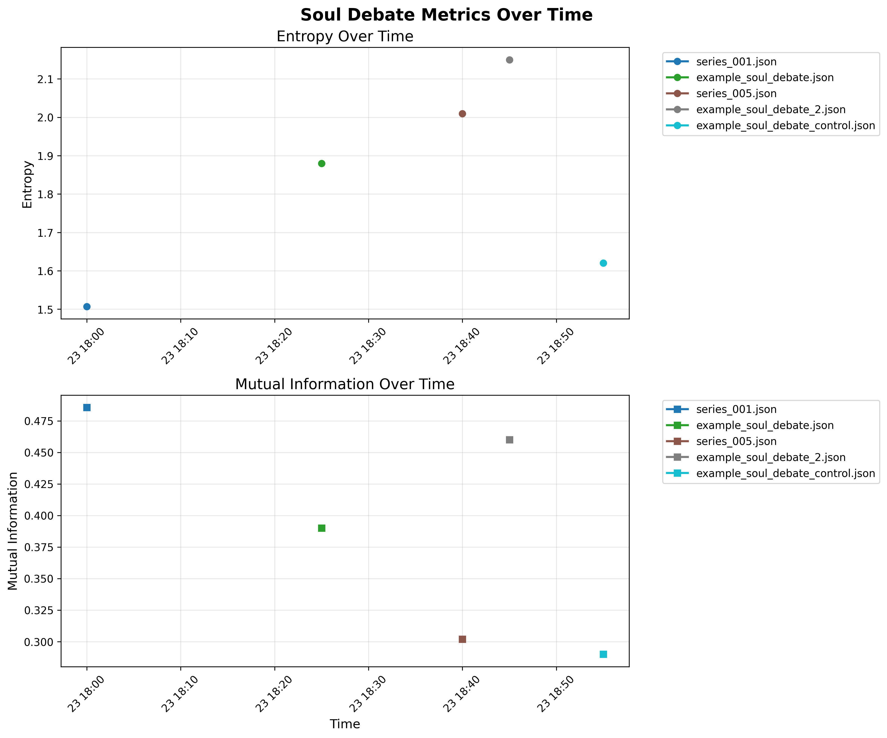

# Synthetic Qualia - Proto-Awareness Test Documentation

This directory contains documentation and test results for the proto-awareness testing framework implemented in CityGrid-Duel. The tests explore the emergence of proto-consciousness and qualia-like phenomena in grid-based neural networks.

## Overview
The proto-awareness tests measure the system's ability to:
- Develop internal representations of environmental states
- Demonstrate self-referential processing
- Exhibit goal-directed behavior
- Show signs of subjective experience

## Implementation
The tests are integrated with the main grid duel energy system, using neural network patterns to detect potential emergence of awareness-like characteristics.

## Analysis Tools

### compare_logs.py Script
The `scripts/compare_logs.py` tool allows for comprehensive analysis of soul debate JSON log files. It supports:

- **Multiple file comparison**: Analyze metrics across multiple log files simultaneously
- **Time-series visualization**: Generate plots showing entropy and mutual information trends over time
- **Statistical summaries**: Display comprehensive statistics for all processed files
- **Flexible output**: Save plots to specified directories (default: `docs/qualia/imgs/`)

#### Usage Examples

Basic comparison of log files:
```bash
python scripts/compare_logs.py logs/example_soul_debate.json logs/example_soul_debate_2.json
```

Analyze all example files:
```bash
python scripts/compare_logs.py logs/example_*.json
```

Generate statistics only (no plots):
```bash
python scripts/compare_logs.py logs/example_*.json --no-plots
```

Custom output directory:
```bash
python scripts/compare_logs.py logs/*.json --output-dir custom/output/path/
```

#### Generated Visualizations
The script creates time-series plots showing:
- **Entropy metrics** over time across different log files
- **Mutual Information** trends with temporal correlation
- **Multi-file comparison** with distinct styling for each input file

Sample visualization: 

## Results
Detailed test results and neural network summaries can be found in the accompanying JSON files.